## 目录

- [1. 请简述 `head.s` 的工作原理](#1-请简述-heads-的工作原理)
- [2. 请记录 `head.s` 的内存分布状况，写明每个数据段，代码段，栈段的起始与终止的内存地址](#2-请记录-heads-的内存分布状况写明每个数据段代码段栈段的起始与终止的内存地址)
- [3. 简述 `head.s` `57` 至 `62` 行在做什么？](#3-简述-heads-57-至-62-行在做什么)
- [4. 简述 `iret` 执行后， `pc` 如何找到下一条指令？](#4-简述-iret-执行后-pc-如何找到下一条指令)
- [5. 记录 `iret` 执行前后，栈是如何变化的？](#5-记录-iret-执行前后栈是如何变化的)
- [6. 当任务进行系统调用时，即 `int 0x80` 时，记录栈的变化情况。](#6-当任务进行系统调用时即-int-0x80-时记录栈的变化情况)
- [7.（1.2.3 计算机引导程序 第6题）调试跟踪 `jmpi 0,8` ，解释如何寻址？](#7123-计算机引导程序-第6题调试跟踪-jmpi-08-解释如何寻址)

## 1. 请简述 `head.s` 的工作原理

`head.s` 是保护模式下多任务内核程序，主要包括32位保护模式下的初始设置代码，三种种类的中断代码（默认中断的过程代码、时钟中断`int 0x08`并实现任务切换的过程代码、系统调用中断`int 0x80`并实现在屏幕上显示字符的过程代码），任务0和任务1的代码和数据。

`head.s`的主要任务是设置一个适当的环境，以准备加载操作系统内核，然后在初始化完成之后程序移动到任务 0 开始执行，并在时钟中断控制下进行任务 0 和 1 之间的切换操作，它们会调用显示系统调用在屏幕上分别显示出字符'A'和'B'，效果如图1。具体工作过程与程序原理解析如下：

<figure style="text-align: center;">
  
  <figcaption>图1 head.s运行效果</figcaption>
</figure>

首先，`head.s`被加载到内存，引导启动程序`boot.s`把引导设备（软盘或映像文件）中的`head`内核代码加载到物理内存0处，然后设置控制寄存器`CR0`中的开启保护运行模式标志，并跳转到内存0处开始执行`head`代码。

接下来`head.s`开始执行，即执行`head.s` 的 `startup_32`，它主要负责初始化设置环境，具体涉及到以下步骤：

1. 切换到 32-bit 模式下的段寄存器并初始化内核栈，主要加载数据段寄存器`DS`、堆寄存器`SS`和堆栈指针`ESP`，所有段的线性基地址都是0, 代码如图2. `boot.s`建立的临时GDT表的第三项为数据段选择符，所以`DS`加载`0x10`，证据见图3.

   <figure style="text-align: center;">
     
     <figcaption>图2 汇编代码</figcaption>
   </figure>

   <figure style="text-align: center;">
     
     <figcaption>图3 临时GDT表</figcaption>
   </figure>

2. 在新的位置重新设置IDT和GDT表，并重新加载所有的段寄存器。此时为真正意义的IDT和GDT表，不同于`boot.s`中为执行`jmpi0,8`而临时建的表。这一部分通过调用`call setup_idt`和`call setup_gdt`两个过程来设置IDT和GDT表，设置GDT后结果如图4所示，

   <figure style="text-align: center;">
     
     <figcaption>图4 设置GDT的结果</figcaption>
   </figure>

3. 设置 8253 系统定时芯片，把计数器通道 0 设置成每隔 10 毫秒向中断控制器发送一个中断请求信号，来产生周期性中断，用于后续触发时钟中断并实现任务切换。代码及注释如图5.

   <figure style="text-align: center;">
     
     <figcaption>图5 设置8253系统定时芯片的代码及注释</figcaption>
   </figure>

   控制字`0x36`的二进制形式为`00110110`，各个位意义如下：

   - 第 7-6 位（`00`）：选择通道 0。
   - 第 5-4 位（`11`）：选择读写模式，`11` 表示先读写低字节，再读写高字节。
   - 第 3-1 位（`011`）：设置工作模式为方式 3，也被称为方波发生器模式。在这种模式下，计数器会自动重复计数，并输出对称的方波。
   - 第 0 位（`0`）：设置计数初值采用二进制。

4. 在IDT表第 8 和第 128（0x80）项处分别设置定时中断门描述符和系统调用陷阱门描述符，满足后续中断和异常处理需要。接下来调试并验证这一部分。

   `head.s`设置定时中断门描述符的汇编代码如图6.

   <figure style="text-align: center;">
     
     <figcaption>图6 设置定时中断门描述符的汇编代码</figcaption>
   </figure>

   地址被放入后，`movl %eax,(%esi)`将`eax`赋值给`esi`所指的地址中，同时将`movl %edx,4(%esi)`赋值给`esi`偏移4个字节的地方，这样就实现了对IDT描述符`0x08`地址的修改。调试验证见图7.

   <figure style="text-align: center;">
     
     <figcaption>图7 修改IDT描述符0x08结果</figcaption>
   </figure>

   同上，设置系统调用陷阱门描述符的方法和上面一致，调试验证见图8.

   <figure style="text-align: center;">
     
     <figcaption>图8 设置系统调用陷阱门描述符结果</figcaption>
   </figure>

5. 跳转到task0 的用户态程序，该部分操作主要目的是为移动到任务0中执行来操作堆栈内容，在堆栈中人工建立中断返回时的场景。汇编代码如图9.

   <figure style="text-align: center;">
     
     <figcaption>图9 操作堆栈的汇编代码</figcaption>
   </figure>

   简单总结一下，这个过程先将`EFLAGS`中的`NT`标志位复位(由1到0)，然后加载`task0`的TSS段描述符到`TR`（任务寄存器）、LDT段描述符到`LDTR`（局部描述符表寄存器），再将任务0保存在current变量后开启中断，后将数据段，堆栈指针，标志寄存器，代码选择符，代码指针入栈，最后执行中断返回，从内核模式（特权级0）切换到用户模式（特权级3）执行`task0`。调试观察压栈结果如图10.

   <figure style="text-align: center;">
     
     <figcaption>图10 压栈结果</figcaption>
   </figure>

6. task0 或 task1 的用户态程序在运行时，通过系统调用 `int 0x80` 向屏幕上打印字符'A' 或 'B'；时钟中断发生时，内核的中断处理程序实现task0 和task1 的任务切换。这里可以观察task0和task1的汇编代码得出，以图11中task0过程的代码为例。

   <figure style="text-align: center;">
     
     <figcaption>图11 task过程的代码</figcaption>
   </figure>

   
   在用户模式下执行`task0`的代码，通过调用`int 0x80`中段打印字符A，并`loop 1b`循环，起延迟作用，10ms后会响应8253的中断请求信号，执行`0x08`中断，该中断将任务切换至`task1`。

## 2. 请记录 `head.s` 的内存分布状况，写明每个数据段，代码段，栈段的起始与终止的内存地址

首先借助资料中的示意图，了解到内核映像文件和内存中`head`代码和数据的分布情况，如图12.

<figure style="text-align: center;">
  
  <figcaption>图12 内存中head代码和数据的分布情况</figcaption>
</figure>

接下来逐一寻找每个段的内存地址。

1. 观察GDT，总览内存：将断点设置在`iret`句并运行至此处，点击`dbg-bochs`View中的GDT查看GDT（全局描述符表）的内容如下

   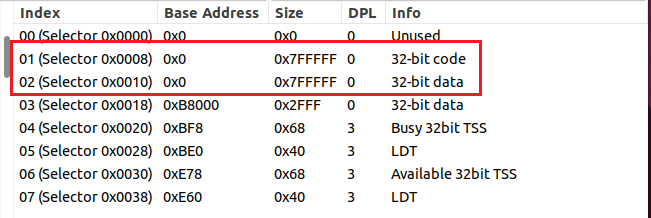

   根据x86手册中对选择子的叙述，`selector 0x00`为NULL 描述符，不使用；`selector 0x08`指向内核代码段；`selector 0x10`指向内核数据段；`selector 0x18`称为屏幕/视频段，作为一种文本缓冲区被设置。

   | 名称       | 起始地址 | 终止地址   | SIZE |
   | ---------- | -------- | ---------- | ---- |
   | 内核代码段 | 0x0      | 0x007FFFFF | 8 Mb |
   | 内核数据段 | 0x0      | 0x007FFFFF | 8 Mb |

2. LDT / TSS：利用刚刚观察的GDT表信息，得到两个LDT和两个TSS的`Base Address`和`Size`；根据内存分布示意图，得出LDT0、LDT1、TSS0、TSS1的起始地址，终止地址。

3. 通过在0x0处设断点，查看到`head`程序的反汇编代码，结合`head.s`汇编代码可以得到每个数据段（绿色、粉色和浅蓝色）、代码段（黄色）、栈段（深蓝色）的分布情况。（颜色指图12中示意的颜色）

   - 代码段（前10个过程均位于底部初始设置代码段）

     | 名称               | 起始地址 | 终止地址 |
     | ------------------ | -------- | -------- |
     | `startup_32`       | 0x00     | 0xac     |
     | `setup_gdt`        | 0xad     | 0xb4     |
     | `setup_idt`        | 0xb5     | 0xc7     |
     | `rp_sidt`          | 0xcd     | 0xe4     |
     | `write_char`       | 0xe5     | 0x113    |
     | `ignore_int`       | 0x114    | 0x129    |
     | `timer_interrupt`  | 0x12a    | 0x165    |
     | `system_interrupt` | 0x166    | 0x17c    |
     | `task0`            | 0x10e0   | 0x10f3   |
     | `task1`            | 0x10f4   | 0x1107   |

     下图展示了寻找一些过程代码起始地址的证明：

     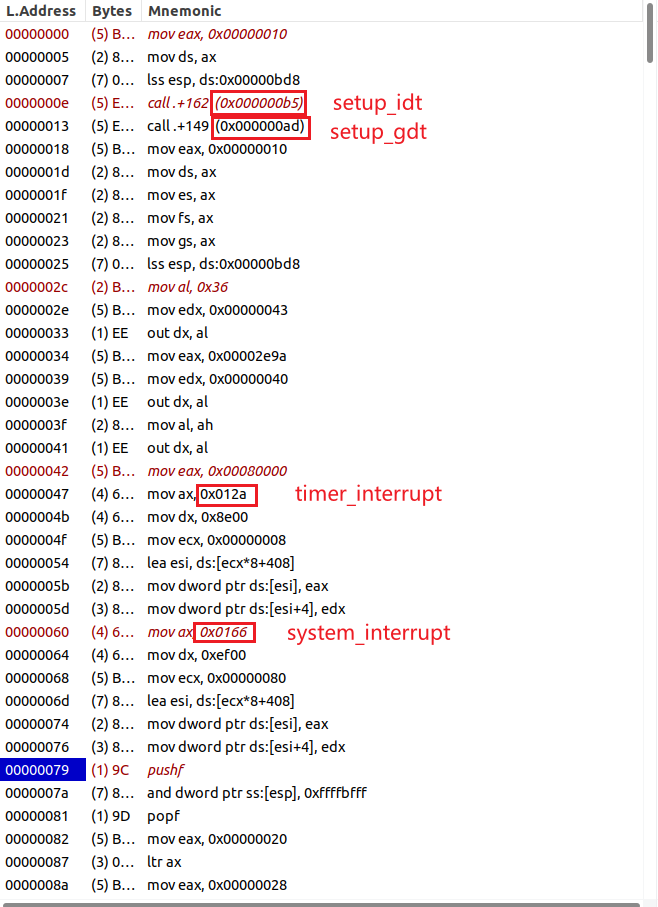

   - 数据段

     | 名称                        | 起始地址 | 终止地址 |
     | --------------------------- | -------- | -------- |
     | LDT0                        | 0xbe0    | 0x1f     |
     | TSS0                        | 0xbf8    | 0xc5f    |
     | LDT1                        | 0xe60    | 0xe9f    |
     | TSS1                        | 0xe78    | 0xedf    |
     | current（记录任务号）       | 0x17d    | 0x180    |
     | scr_loc（屏幕当前显示位置） | 0x181    | 0x184    |
     | IDT                         | 0x198    | 0x997    |
     | GDT                         | 0x998    | 0x9d7    |

     LDT与TSS的寻找依靠GDT表；current，scr_loc通过汇编代码与调试过程找出；以下是寻找IDT和GDT内存地址的过程。

     找到寄存器`gdtr`和`idtr`，如下图，这两个寄存器显示格式是 `base（limit）`。因此：

     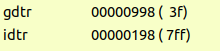

     **GDTR = `00000998（3f）`** → 表示 `GDT base = 0x00000998`，`GDT limit = 0x003F`.

     **IDTR = `00000198（7ff）`** → 表示 `IDT base = 0x00000198`，`IDT limit = 0x07FF`.

     特别地，`limit` 是表字节长度减 1（limit = size-1）。由此计算出GDT和IDT的内存地址。

   - 栈段：（起始地址为栈底，终止地址为栈顶）

     | 名称         | 起始地址 | 终止地址 |
     | ------------ | -------- | -------- |
     | `init_stack` | 0x9d8    | 0xbd7    |
     | `krn_stk0`   | 0xc60    | 0xe5f    |
     | `krn_stk1`   | 0xee0    | 0x10df   |
     | `usr_stk1`   | 0x1108   | 0x1307   |

     1. 栈的大小如何确定：观察`head.s`汇编代码，可以在`tss`段和`task1`代码中看到`.fill 128,4,0`，它表示分配128个4字节的单元，全部初始化为0，所以用户栈和内核栈的大小均为128 *4 =521字节（`0x200`）。
     
        
     
     2. `krn_stk`找法：以`krn_stk0`为例，观察汇编代码，如下图，因此我们可以通过寻找TSS0的esp0字段来寻找`krn_stk0`的地址，esp0 位于 TSS 的偏移 `+4`的位置。
     
        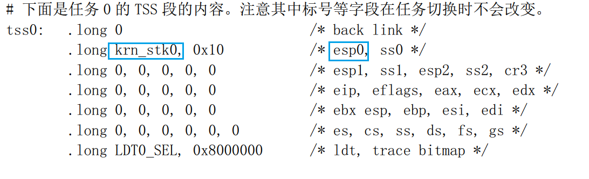接着，已知TSS0的起始地址为`0xbf8`，在`dbg-bochs`中找到此处内存，并寻找esp0字段的位置，如下图，解析得到`0xe60`，这是`krn_stk0`的末端，而它的可用区间可计算得出`0xc60 - 0xe5f`。
     
        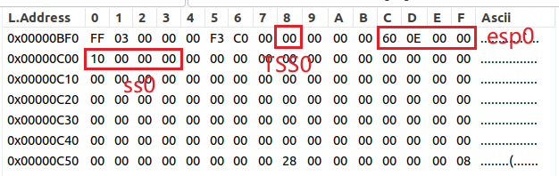
     
     3. 用户栈找法：`init_stack`通过观察反汇编代码，即可找到栈的栈顶地址；`usr_stk1`使用类似于寻找`krn_stk`的方法找到栈顶地址，然后计算，寻找过程可见下方图。
     
        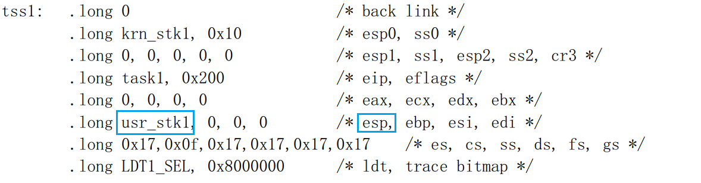
     
        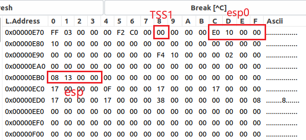

## 3. 简述 `head.s` `57` 至 `62` 行在做什么？

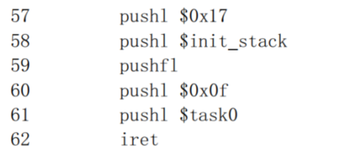

逐句解析：

1. `pushl $0x17`：把任务 0 的当前局部数据段（堆栈段）的选择子压入堆栈。`0x17`是选择子的值，表示为二进制形式为`0001 0111`，按照x86系统手册的规定，二进制格式解析如下，

   - bits 0–1 (RPL) = `0x17 & 0x3` = `0b11` = 3 （请求特权级 = 3）

   - bit 2 (TI) = `(0x17 >> 2) & 1` = `1` → 1 表示 LDT（即这是 LDT 中的条目）

   - index = `0x17 >> 3` = `0x2` = 2 → 在 LDT 的索引为 2

   因此，`0x17` 表示 LDT 表中的第 2 项（index = 2），RPL = 3，表示它是给用户访问的选择子，且要在 LDT 中查找。如下图汇编代码中的LDT条目，可以找到该选择子指向的内容。

   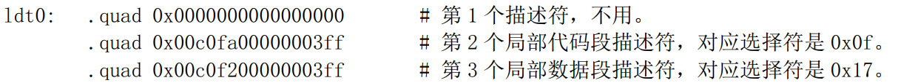

2. `pushl $init_stack`：把堆栈指针入栈，作用是在刚进入保护模式时用于加载`SS：ESP`堆栈指针值到内存中，`init_stack` 是堆栈指针的值。事实上，这里也可以直接将 ESP 寄存器的值压入堆栈，它们都能保存任务0的堆栈指针，作为将来返回时要恢复的用户ESP。观察编译后的二进制程序时，通过反汇编发现程序直接压入一个立即数，它就是`init_stack`，下图可以看出这些信息。

   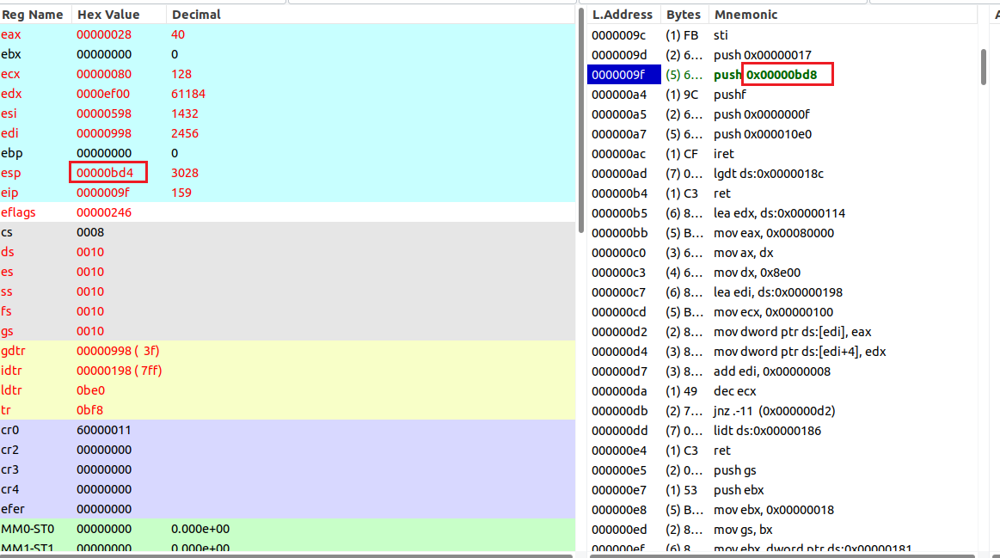

3. `pushfl`：把标志寄存器的值入栈，这个值包括处理器状态标志，如进位标志、溢出标志等，如下图。

   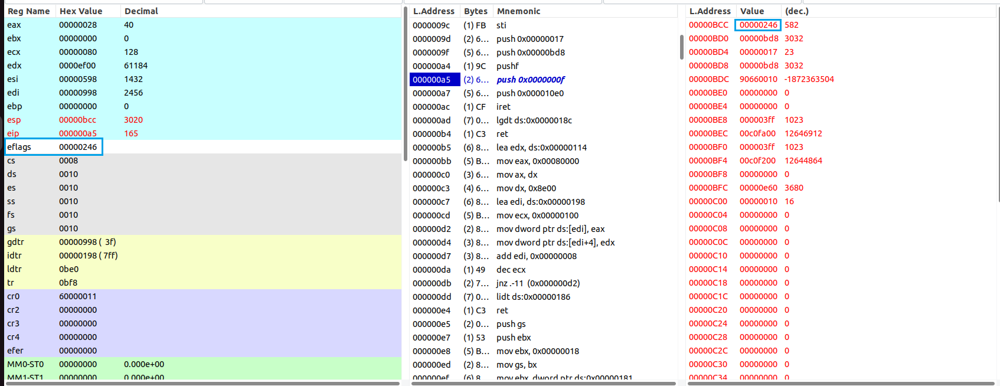

4. `pushl $0x0f`：把当前局部空间的代码段选择符入栈。这个选择符指定了任务 0 的代码段，`0x0f`表示为二进制形式为`0000 1111`，表示 “LDT 中的第 1 项，RPL=3”，通过LDT条目可以看出这个选择子就是用户代码段的选择子。

5. `pushl $task0`：把代码指针入栈，通过反汇编可以知道`task0`的起始地址是`0x10e0`。

   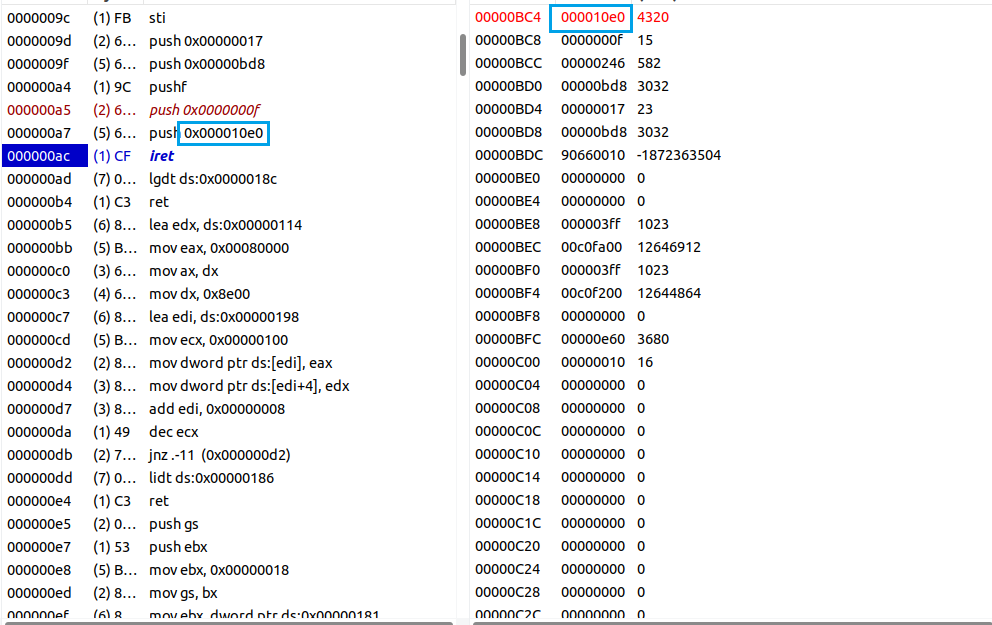

6. `iret`：执行中断返回指令，从而切换到特权级 3 （用户态）的任务 0 中执行。它会从栈中弹出保存的信息，包括代码指针、代码段选择符、标志寄存器值等，并使用这些信息切换到任务 0 的执行上下文，这实现了从中断处理程序返回到任务 0 的操作。

总结：57-62行的主要作用就是在堆栈中人工建立中断返回时的场景，为移动到`task0`中执行来设置正确的段选择符和堆栈指针，最后使用 `iret` 指令来中断返回，形成任务切换的场景。

## 4. 简述 `iret` 执行后， `pc` 如何找到下一条指令？

调试现象：`iret` 指令用于从中断处理程序返回到被中断的正常的程序执行，并恢复被中断程序的现场。`iret`指令执行完毕后，可以看到`pc`跳转到`000010e0`处，这是task0的入口地址，同时栈和一些寄存器都发生了变化，如下图。

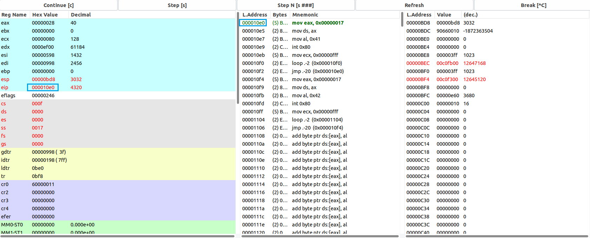

原理解释：执行`iret`指令后，处理器发生以下操作来寻找下一条指令：

1. 恢复寄存器状态：`iret` 指令从当前栈中依次弹出（pop）一系列值来恢复上下文，包括`EIP`（局部代码段的指针，恢复`PC`）, `CS`（代码段选择符）,  `EFLAGS`（标志寄存器），`ESP`、`SS`（堆栈指针，这里发生的是从更高特权级返回到更低特权级，就会额外从栈中弹出 `ESP` 和 `SS` 来恢复返回时的栈）的值，这些值实际上都是57-61行为营造环境人工压入栈中的。

2. 把弹出的值加载到寄存器中，寄存器结果通过上图可以得到验证，与之前压入栈的值均能对应，具体如下：

   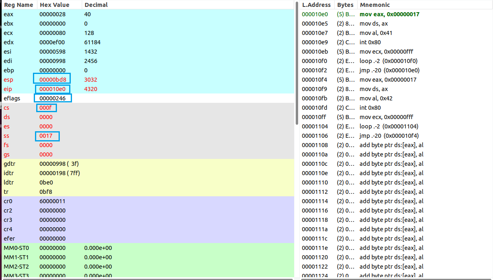

   - `CS`和`EIP`寄存器，`CS` 寄存器包含了新的代码段选择符，它指示了中断返回后应执行的代码段；`EIP` 寄存器包含了下一条要执行的指令的地址。具体来说，`iret`指令会将从堆栈中弹出的`CS`和`EIP`寄存器的值组合成一个32位的线性地址(`CS`作为段选择子查表找到基地址，再加上`EIP`偏移地址得到线性地址)，然后将该线性地址存储在程序计数器PC中，以便继续执行被中断程序被中断前的指令。
   - `EFLAGS`寄存器，恢复被中断程序的标志位，这些标志用于控制处理器的状态和行为。
   - `SS`和`ESP`寄存器，确保栈指针正确地指向下一个栈帧。

3. 上下文切换完毕，CPU开始根据PC的值执行指令，继续程序的正常执行，也就是任务0的程序。

## 5. 记录 `iret` 执行前后，栈是如何变化的？

#### `iret`执行前

如下图，根据57-61行的一系列压栈操作，栈中从下到上保存的依次是：任务0的堆栈段选择符，堆栈指针，标志寄存器的值，任务0的代码段选择符，代码指针。

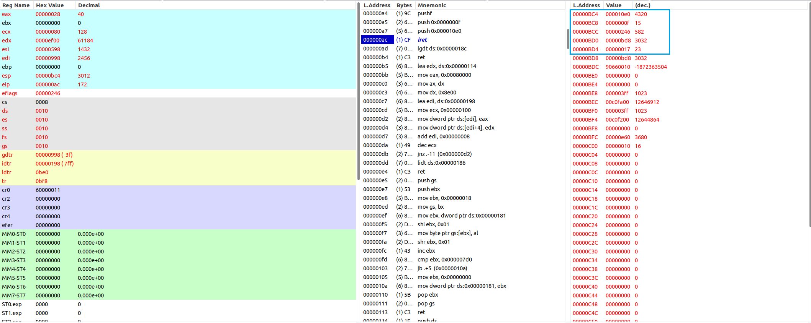

#### `iret`执行后

如下图，栈中内容被清空，上面五个值被弹出，栈底即为栈顶`init_stack`（`0xbd8`），CPU栈指针（`ESP`）变为用户栈设定值（`init_stack`），这说明原来的内核栈空间变为任务0用户栈空间。

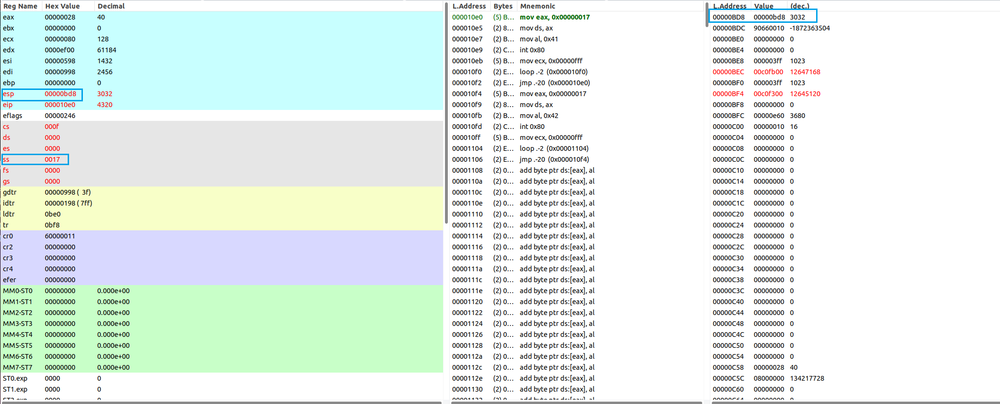

## 6. 当任务进行系统调用时，即 `int 0x80` 时，记录栈的变化情况。

#### `int 0x80`执行前

栈情况：`esp`=0xbd8，`ss`=0x17（基地址为0x0），栈为空（正常应该包含task 0 正常执行的栈帧，包括函数调用的参数、局部变量等，但task0压根没有使用局部数据，故栈表现为空）。

CPU情况：当任务 0 希望执行系统调用时，它会将系统调用号和相关显示的值65(‘A’)加载到寄存器中。

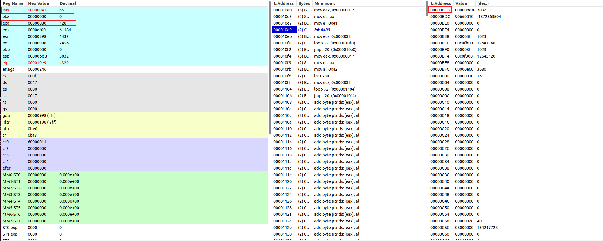

#### `int 0x80`执行后

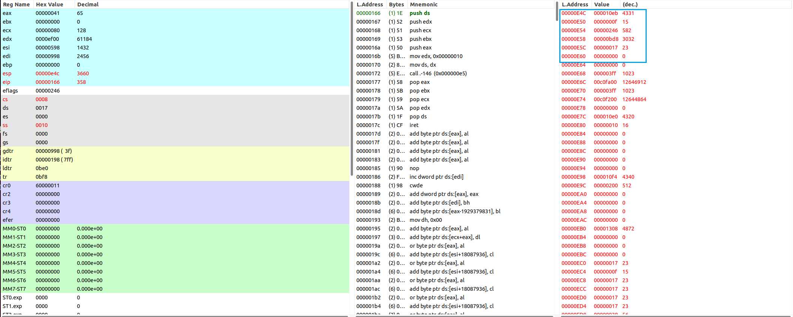

`int 0x80`执行后，CPU从当前任务的任务状态段TSS0中取出新堆栈(task0的内核栈空间`krn_stk0`)的段选择符和偏移值`ss0`和`esp0`，随后切换到内核栈（见上图，`ESP`发生改变）。然后开始保存task0当前环境，把原task0的数据段选择符`ss`（`00000017`）和堆栈指针`esp`（`00000bd8`）压入任务0内核态堆栈，然后把标志寄存器`eflags`的内容（`00000246`）和返回位置`cs`（`0000000f`）、`eip`（`000010eb`）也依次压入任务0内核态堆栈。

之后进入由 IDT 指向的中断服务例程（`system_interrupt`），在`head.s`中处理程序`system_interrupt` 做了 `push %ds; pushl %edx; pushl %ecx; pushl %ebx; pushl %eax`（保存通用寄存器），设置 `ds`，调用 `write_char`（显示字符），然后在处理完毕后逐一 `pop` 恢复寄存器并执行 `iret`。`iret` 会把之前 CPU 自动 push 的项弹出并返回到用户态。如下图，在执行完`int 0x80`并完成中断处理程序后，堆栈与寄存器又恢复了原样，并且PC指向中断发生的下一条指令处继续执行。

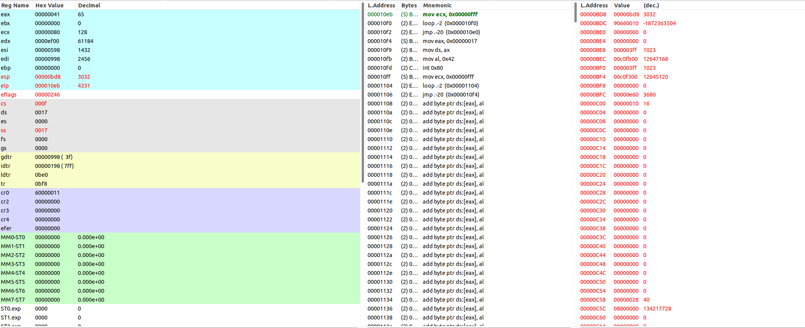

## 7.（1.2.3 计算机引导程序 第6题）调试跟踪 `jmpi 0,8` ，解释如何寻址？

`jmpi` 指令通常用于在x86架构的实模式下进行跳转，这个指令的作用是无条件跳转到一个新的代码段，以执行那里的指令。接下来从头调试观察

首先在0x7c00 处设置断点，运行程序，即可查看 boot.s 的汇编代码。

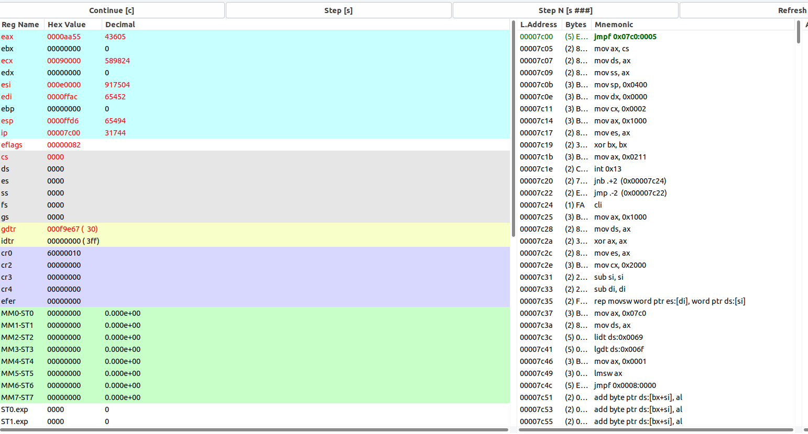

`jmpi 0,8`的反汇编代码代码，位于地址 0x7c4c 处，在此处设置一个断点并运行到此处。

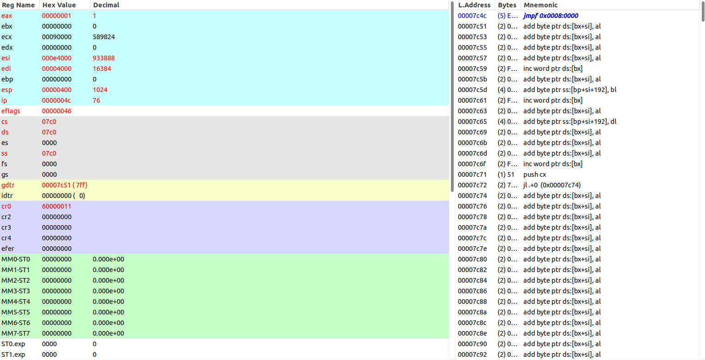

单步运行，程序直接跳转到内存0处。

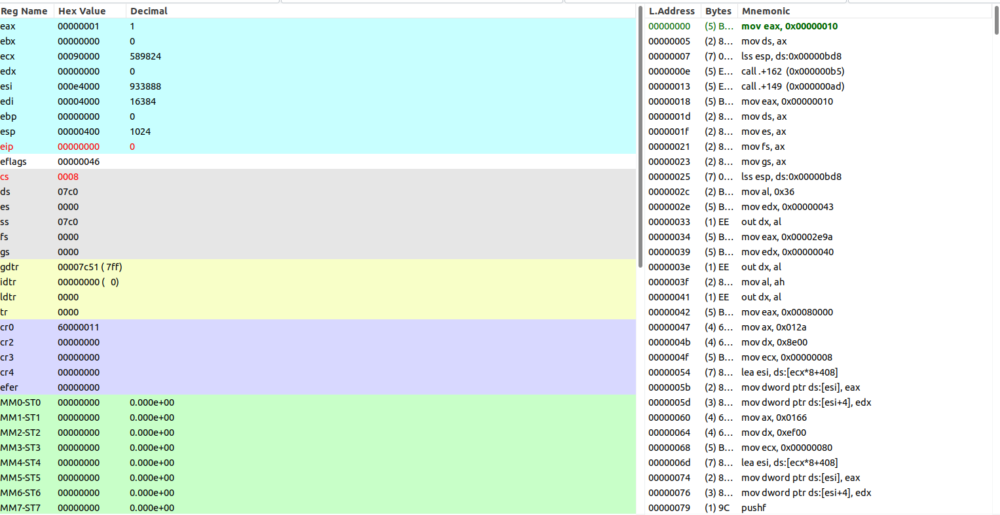

`jmpi`指令的寻址方式是使用一个绝对的偏移地址。它的操作数是一个16位的偏移地址，其格式通常为`jmpi <偏移地址>`。

 `jmpi 0,8`寻址：

`0,8`的二进制表示为`0000 0000 0000 0000 0000 0000 0000 1000`，其中8赋值给`CS`，`CS`作为段选择子使用，0赋值给`IP`。根据x86手册，左4位`0000`表示内存偏移地址，右2位`00`表示特权级为0，右第3位`0`表示`gdt`表，右第4位`1`表示`gdt`的索引。因此，`jmpi 0,8`最终将会跳转到`gdt`中第一个段描述符指向的地址，也就是地址0.
