## 目录


- [1. 当执行完 `system_interrupt` 函数，执行 `153` 行 `iret` 时，记录栈的变化情况。](#1-当执行完-system_interrupt-函数执行-153-行-iret-时记录栈的变化情况)
- [2. 当进入和退出 `system_interrupt` 时，都发生了模式切换，请总结模式切换时，特权级是如何改变的？栈切换吗？如何进行切换的？](#2-当进入和退出-system_interrupt-时都发生了模式切换请总结模式切换时特权级是如何改变的栈切换吗如何进行切换的)
- [3. 当时钟中断发生，进入到 `timer_interrupt` 程序，请详细记录从任务 `0` 切换到任务 `1` 的过程。](#3-当时钟中断发生进入到-timer_interrupt-程序请详细记录从任务-0-切换到任务-1-的过程)
- [4. 又过了 `10ms` ，从任务1切换回到任务 `0` ，整个流程是怎样的？ `TSS` 是如何变化的？各个寄存器的值是如何变化的？](#4-又过了-10ms-从任务1切换回到任务-0-整个流程是怎样的-tss-是如何变化的各个寄存器的值是如何变化的)
- [5. 请详细总结任务切换的过程](#5-请详细总结任务切换的过程)


## 1. 当执行完 `system_interrupt` 函数，执行 `153` 行 `iret` 时，记录栈的变化情况。

在实验1的最后，探究了`startup_32`结束，执行中断返回指令，从而切换到特权级 3 （用户态）的任务 0 中执行。`task0`开始执行，在该过程中由`int 0x80`指令进入系统调用中断并执行中断处理程序，即`system_interrupt` 函数。在`int 0x80`句打断点，`step`进入`system_interrupt`函数进行观察。

首先记录一下`system_interrupt`调用前的栈状态，以及代码执行情况与寄存器状态，如下图。

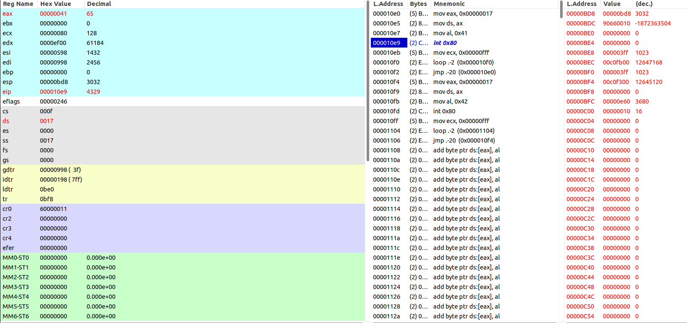

1. 进入`system_interrupt`，首先执行一系列压栈操作，如下图。

   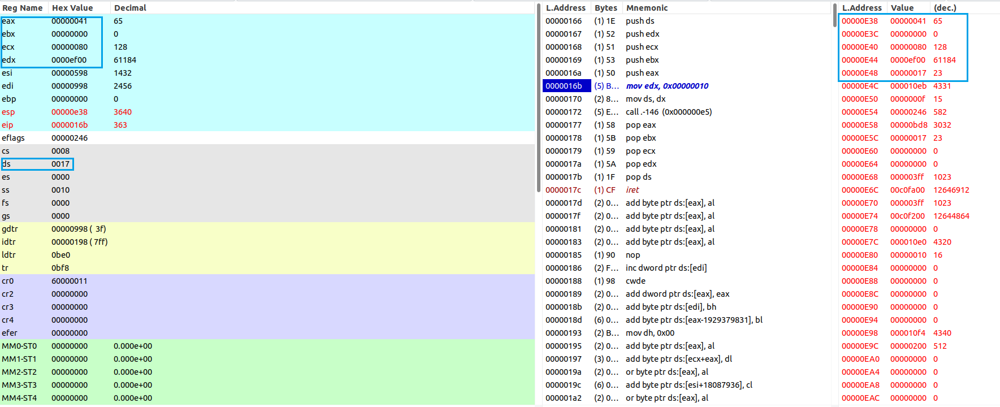

2. 然后让DS指向内核数据段（LDT表第三项），之后调用显示字符子程序 write_char，显示 AL 中的字符('A')，涉及代码如下。

   ```assembly
   movl $0x10, %edx    # 首先让DS指向内核数据段
   mov %dx, %ds
   call write_char    # 然后调用显示字符子程序write_char，显示AL中的字符
   ```

3. 接着准备返回，执行一些列出栈操作，如下图，寄存器正确恢复。

   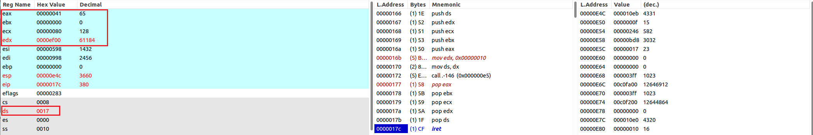

4. 执行`iret`指令。

执行`iret`指令前，栈中从下到上保存的依次是：任务0的堆栈段选择符（`SS`），堆栈指针（`ESP`），标志寄存器的值（`EFLAGS`），任务0的代码段选择符（`CS`），代码指针（`EIP`）。如下图。

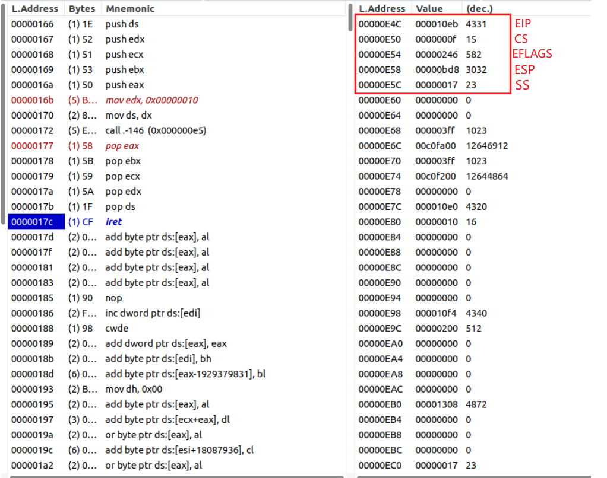

执行`iret`指令后，可以观察到栈和寄存器又恢复到`system_interrupt`被调用前的场景，`EIP`指向`int 0x80`的下一条语句继续执行代码。

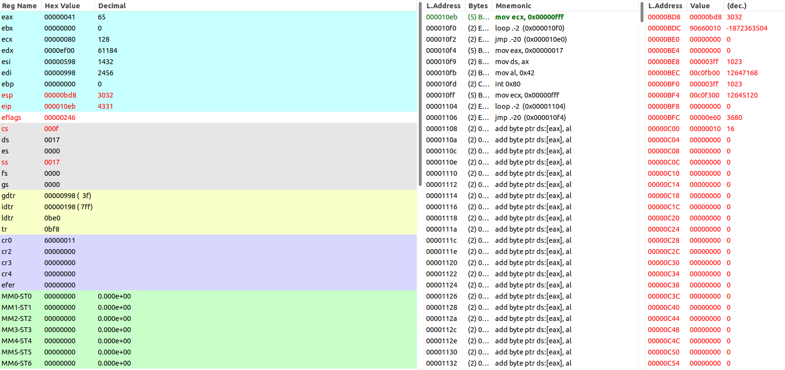

因此，`iret`指令做了这样几件事情：

1. 恢复寄存器状态：`iret` 指令从当前栈中依次弹出（pop）一系列值来恢复上下文，包括`EIP`（局部代码段的指针，恢复`PC`）, `CS`（代码段选择符）,  `EFLAGS`（标志寄存器），`ESP`、`SS`（堆栈指针，这里发生的是从更高特权级返回到更低特权级，就会额外从栈中弹出 `ESP` 和 `SS` 来恢复返回时的栈）的值。

2. 把弹出的值加载到寄存器中，寄存器结果通过上面两张图可以得到验证，与之前栈中的值和注释均能对应。

   - `CS`和`EIP`寄存器，`CS` 寄存器包含了新的代码段选择符，它指示了中断返回后应执行的代码段；`EIP` 寄存器包含了下一条要执行的指令的地址。具体来说，`iret`指令会将从堆栈中弹出的`CS`和`EIP`寄存器的值组合成一个32位的线性地址(`CS`作为段选择子查表找到基地址，再加上`EIP`偏移地址得到线性地址)，然后将该线性地址存储在程序计数器PC中，以便继续执行被中断程序被中断前的指令。

   - `EFLAGS`寄存器，恢复被中断程序的标志位，这些标志用于控制处理器的状态和行为。

   - `SS`和`ESP`寄存器，确保栈指针正确地指向下一个栈帧。

3. 上下文切换完毕，CPU开始根据PC的值执行指令，继续程序的正常执行。


## 2. 当进入和退出 `system_interrupt` 时，都发生了模式切换，请总结模式切换时，特权级是如何改变的？栈切换吗？如何进行切换的？

模式切换CPU需要两件事，**特权级改变**和**栈切换**：

1. 特权级改变：用户态（CPL=3）通过 `int 0x80` 触发的中断 → CPU 切换到内核态（CPL=0）执行中断处理；返回时 `iret` 将把 CPU 恢复到原来的 CPL（通常回到 3）。整个过程由硬件完成检查与切换，通过`CS`寄存器来标明特权级的切换。

2. 是否切换栈：如果中断发生在更低特权级（比如从 CPL=3 到 CPL=0），CPU 会进行栈切换，这是内核栈与用户栈之间的切换。具体表现为：它从 TSS 中载入内核栈指针（SS:ESP）并把 CPU 的栈切换到内核栈；返回（`iret` 回到 CPL3）时 CPU 会把栈切换回用户栈（通过从内核栈弹出并恢复用户的 SS:ESP）。

**整体模式切换过程：**

1. 保存当前上下文：在模式切换之前，当前执行的任务的上下文以及当前特权级需要被保存压入栈中

2. 选择新特权级别：根据要切换到的特权级别，操作系统选择新的代码段描述符和堆栈描述符，切换堆栈和特权级，并将它们加载到相应的寄存器中。

   - 在进入内核态时，通常会使用内核堆栈，以避免破坏用户堆栈。

   - 在退出内核态时，特权级和堆栈状态会恢复，以确保程序的正常执行。

**具体过程描述：**

进入 `system_interrupt`（用户 → 内核），当前执行态是用户（CPL=3），IDT 为 `int 0x80` 配置为`interrupt gate`。（CPU 允许低级别代码通过调用门或中断、陷阱门来调用或转移到高级别代码中运行）

1. 执行 `int 0x80` 指令（软件中断）。CPU 用中断向量从 IDT 找到对应的 gate 描述符，IDT 中断门类型与 DPL 决定是否允许从 CPL3 调用。
2. 硬件检查权限：检查IDT gate 的 DPL 与 selector 的 RPL、CPL，若允许则继续.
3. 由于此处是从较低特权到较高特权的切换，CPU会从TSS读出内核栈` SS:ESP`（通常是 `esp0`/`ss0`字段，实验1已演示找出它们的过程，这里不赘述）并把 `SS/ESP` 设为该值，来完成栈切换进入内核栈。随后 CPU 在内核栈上按顺序压入被中断时的上下文（即原任务0用户栈指针`ss`和`esp`，标志寄存器`eflags`的内容，返回位置`cs`、`eip`的值），该步骤是硬件自动压入，不需要手动编码。
4. CPU 把 CS:EIP 设置为 IDT 中断门指向的内核处理入口，并把 IF 清 0（禁止中断），然后跳到内核处理例程（如你的 `system_interrupt`）。此时 CPL = 0（内核态），并开始执行内核代码。可以通过上图中的`CS`寄存器查看，它已经由`0xf` 变为 `0x8`。

退出 `system_interrupt`（内核 → 用户），也就是内核完成处理并执行 `iret`，还原任务0的用户态堆栈。具体过程为：

1. 首先 `pop` 恢复 `EIP`、`CS`、`EFLAGS`（这三项总是弹出）。
2. 如果返回目标的 CPL < 当前 CPL（也就是要返回到更低权限，如本例中就是从 CPL0 回到 CPL3），`iret` 还会从栈上弹出并恢复 SS 和 ESP（把栈切换回用户态的 SS:ESP），然后才转去用户态继续执行，即 `iret` 会把 CPU 的栈/特权都恢复成用户态的上下文，通过上图可以看到`CS`寄存器又回到`0xf`了。


## 3. 当时钟中断发生，进入到 `timer_interrupt` 程序，请详细记录从任务 `0` 切换到任务 `1` 的过程。

首先寻找`timer_interrupt`程序的地址，在设置定时中断门描述符时，汇编代码中要取定时中断处理程序`timer_interrut`的地址，结合反汇编找到地址为`0x12a`，如下图。

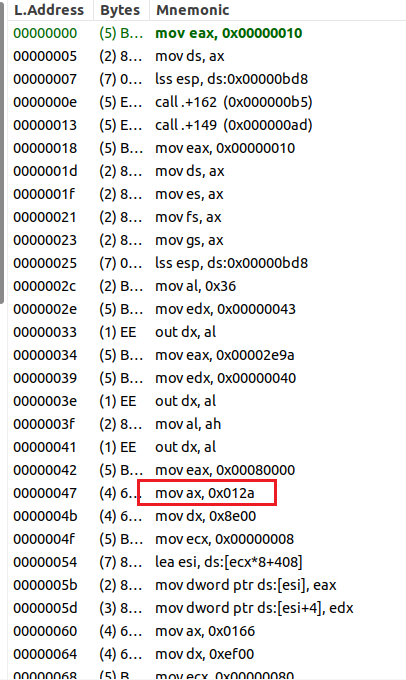

在`0x12b`处打断点并执行到此处，见下图，可以看到已经显示了几个'A'，这说明task0开始执行了一会儿，并且当前CPU接收了时钟中断请求信号，将控制权切换到中断处理程序（CPL=0，切换到内核栈）。接下来执行`timer_interrupt`过程中会将CPU执行指令从task0切换到task1。

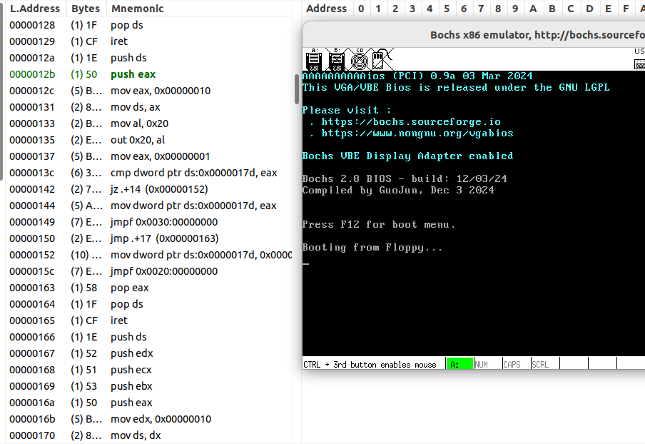

1. 首先，`timer_interrupt` 进入后把 `ds` 指向内核数据段，随后向8259A发送`EOI`命令，这会立即允许其他硬件中断（关中断）；然后通过 `movl $1, %eax; cmpl %eax, current` 判断要切换到哪一个任务，`current` 是全局变量，表示当前任务索引，定义在文件中。这部分汇编代码如下：

   ```assembly
   timer_interrupt:
   	push %ds
   	pushl %eax
   	movl $0x10, %eax    # 首先让DS指向内核数据段
   	mov %ax, %ds
   	movb $0x20, %al    # 然后立刻允许其他硬件中断，即向8259A发送EOI命令
   	outb %al, $0x20
   	movl $1, %eax
   	cmpl %eax, current    # 接着判断当前任务，若是任务1则去执行任务0，或反之
   ```

   接下来具体的条件分支语句为：

   ```assembly
   	je 1f
   	movl %eax, current    # 若当前任务是0，则把1存入current，并跳转到任务1
   	ljmp $TSS1_SEL, $0    # 去执行
   	jmp 2f    # 切换完毕，跳转到退出语句
   1:	movl $0, current    # 若当前任务是1，则把0存入current，并跳转到任务0
   	ljmp $TSS0_SEL, $0    # 去执行
   2:	popl %eax    # 退出
   	pop %ds
   	iret
   ```

2. 由于当前 `current` 不等于 1（即现在是 task0），则 `movl %eax, current`（把 current 设为 1）并执行 `ljmp $TSS1_SEL, $0`。这个 `ljmp`是长转移指令，能够使`PC`远跳转到一个 TSS 描述符，然后触发CPU 的硬件任务切换，把控制权移交给 `TSS1` 描述的任务（task1）。

3. `ljmp $TSS1_SEL,$0` 指令的效果：

   在刚刚进入`timer_interrupt`时，

   单步执行到`ljmp $TSS1_SEL, $0`对应的二进制代码处，输入`info tss`查看并记录跳转前的系统TSS情况，如下图，根据base值可以看出，当前为task0的TSS0。

   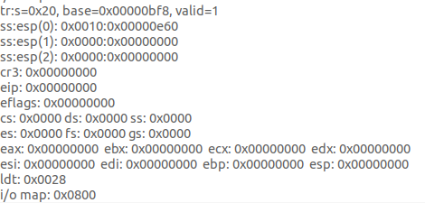

   通过查看GDT表以及`dbg-bochs`注释也可以佐证这一点，如下图。

   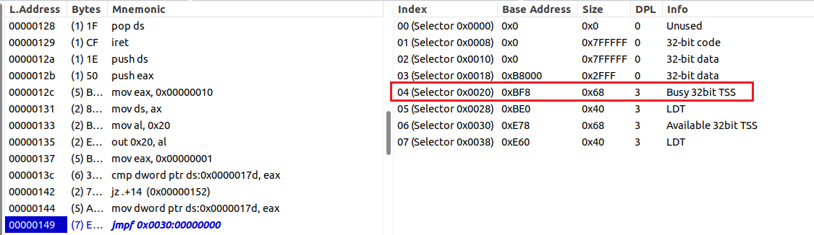

   接下来执行该指令，程序跳转到`0x10f4`位置，如下图，此处正是`task1`的代码段，说明系统已由任务0切换到任务1。通过查看GDT表以及`dbg-bochs`注释，可以注意到当前系统TSS已经转移到task1的TSS1（显示为Busy 32bit TSS）。

   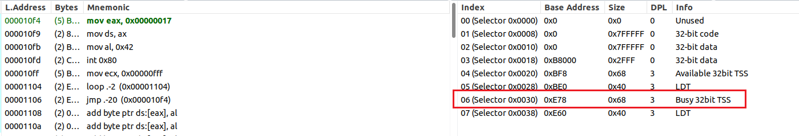

   输入`info tss`查看跳转后的系统TSS情况，如下图，根据base值可以看出，当前为task1的TSS1。

   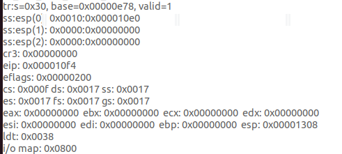

   

## 4. 又过了 `10ms` ，从任务1切换回到任务 `0` ，整个流程是怎样的？ `TSS` 是如何变化的？各个寄存器的值是如何变化的？

根据上一问中的分析，可以得知任务1运行10ms后CPU会再次接收时钟中断请求信号，并进入`timer_interrupt`程序，此时可以看到屏幕上多了几个字符`B`，如下图。

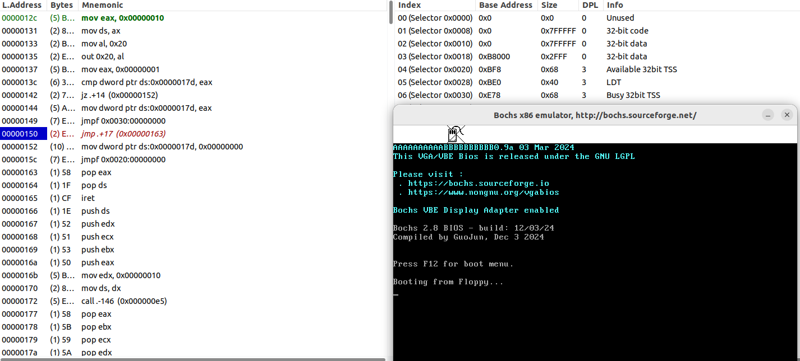

由于当前执行的为任务1，故从任务1切换回到任务0 的关键步骤在`0x15c`指令处，在`0x15c`地址打断点并执行到此处，记录下此时的系统TSS和寄存器情况，如下图。

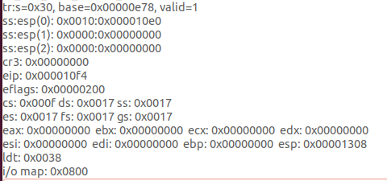

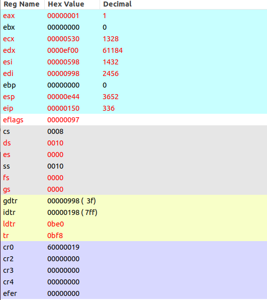

可以看到TSS与寄存器内容相同（红色字体），说明已经将 task1 的上下文保存在 task1 的TSS中。 然后执行 `jmpf 0x0020:0` ，将一个 TSS 选择子（`0x20`）装入 CS，即task0 的TSS，由于第一次任务切换时将寄存器现场保存到了 task0 的TSS0里，因此将TSS切换回来后，`CS:EIP` 会指向第一次任务切换的下一条地址，即`0x8:0x150`。如下图，展示了切换后的寄存器情况，代码执行位置，GDT表情况。

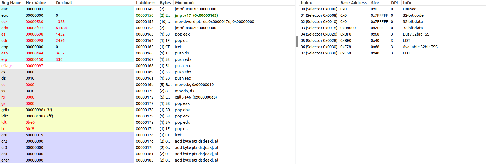

输入`info tss`查看具体的系统TSS情况，如下图。

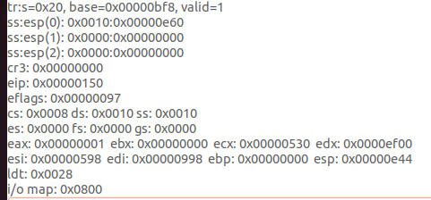

可以看到TSS为task0的TSS0，并且里面保存着第一次切换时的现场，与当前的寄存器值相对应（红色字体）。

## 5. 请详细总结任务切换的过程

1. 时钟中断触发：任务切换通常是由系统中的时钟中断触发的，触发后CPU执行中断处理程序`timer_interrupt `并进入内核态。本实验的时钟中断以固定的时间间隔（每10毫秒）发生一次，它是多任务处理的触发点。
2. 内核判断需要切换任务，然后通过 `ljmp`指令发起硬件切换，CPU 在遇到`ljmp`远跳目标为 TSS 描述符时，会进行接下来一些列的硬件级别动作。
3. 保存当前任务的上下文到旧的 TSS：CPU 在切换时会把被切出的任务的寄存器 / 状态写入其 TSS。在本实验中，要由task0切换到task1时，处理器把task0的`EFLAGS`、`ESP`、`SS`、`CS`、`EIP`等寄存器值写入 `TSS0` 中对应的字段。
4. 读取新的 TSS并把该 TSS 描述的处理器状态装载到寄存器：CPU从新的 TSS 中将即将切换的新任务的上下文信息（寄存器的值）加载到处理器中，TR（任务寄存器）也被更新为新的 TSS 的选择子，在新 TSS 上标记“busy”，使得新进程不能重入，并把旧 TSS 的 selector 写入新 TSS 的 previous-task-link 字段。
5. 跳转到当前新的`EIP`的地址，以新任务的的上下文运行。如果新的`CS`寄存器的 CPL 为用户（3）或内核（0），会发生特权级别切换，相应 CPL 会被设定；如果 CPL 有改变，CPU 按需要同时切换当前堆栈。
6. 栈的切换：新任务的栈（包括用户栈与内核栈）由新TSS的 fields 决定；CPU 装载后，`ESP` 和 `SS` 已被设为新TSS 中的值（即新执行任务的栈配置已生效）。

总结一下，任务切换可以由硬件（`JMP`/`CALL` 到 TSS 描述符或 Task Gate）或软件（内核保存/恢复寄存器）触发。CPU 在切换时会把被切出的任务的寄存器/状态写入其 TSS（old TSS），再从目标任务的 TSS 载入寄存器/状态到处理器（new TSS）；TR（Task Register）更新为新任务的 TSS selector；如果特权级发生变化，CPU 同时会完成栈切换（依靠 TSS 中的 esp0/ss0 等）。任务切换的本质，就是由硬件完成“保存/加载上下文”这一过程。这个过程允许多个任务在同一个系统中轮流执行，实现多任务处理。


