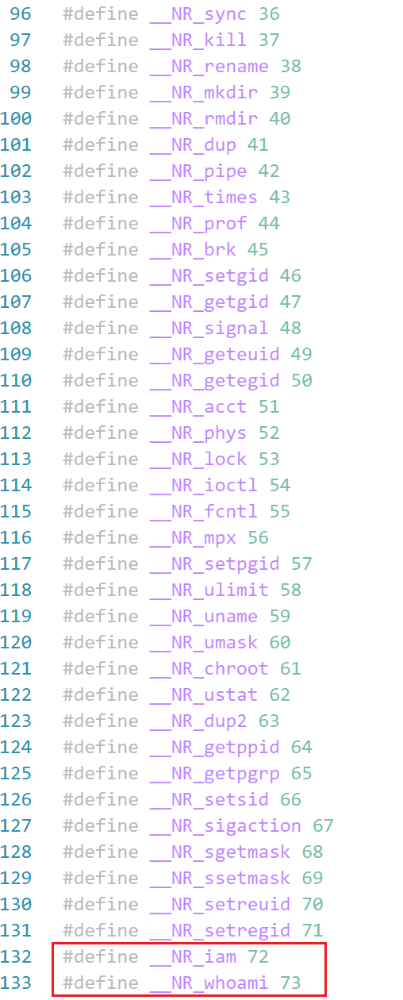
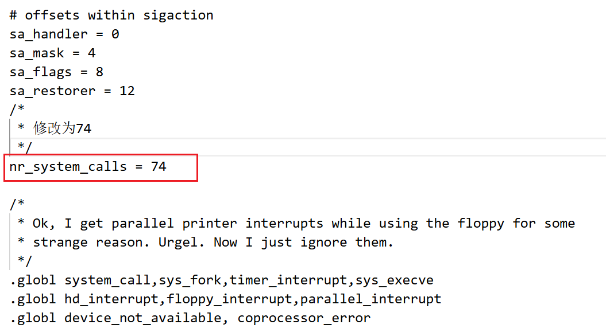
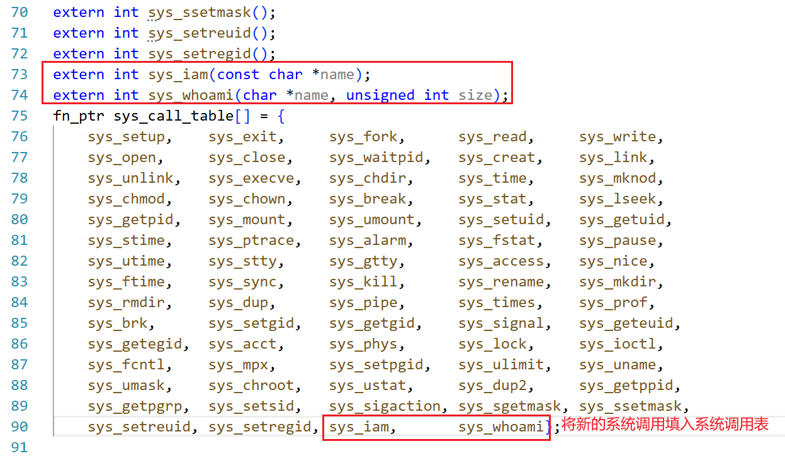
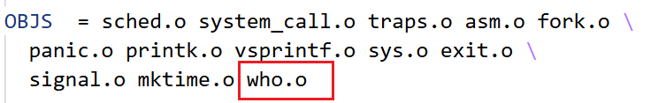
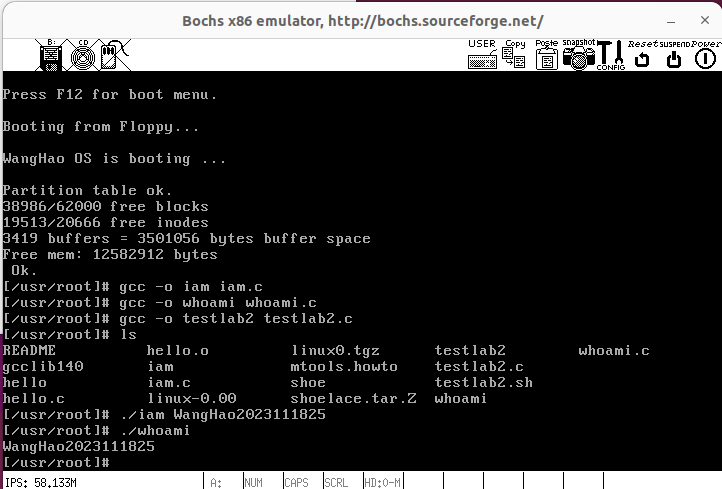
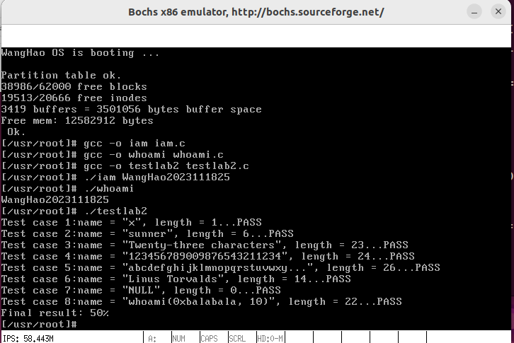
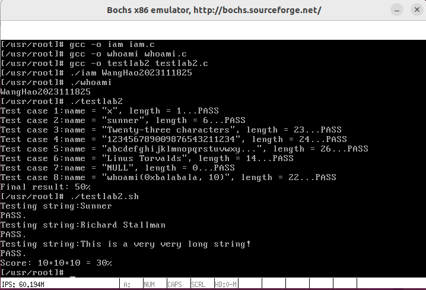

## 1. 实验目的

- 建立对系统调用接口的深入认识
- 掌握系统调用的基本过程
- 能完成系统调用的全面控制
- 为后续实验做准备

## 2. 实验内容

此次实验的基本内容是：在 `Linux 0.11` 上添加两个系统调用，并编写两个简单的应用程序测试它们。

### 2.1. `iam()`

第一个系统调用是 `iam()` ，其原型为：

```
int iam(const char * name);
```

完成的功能是将字符串参数 `name` 的内容拷贝到内核中保存下来。 要求 `name` 的长度不能超过 `23` 个字符。返回值是拷贝的字符数。 如果 `name` 的字符个数超过了 `23` ，则返回 `-1` ，并置 `errno` 为 `EINVAL` 。

在 `kernal/who.c` 中实现此系统调用。

### 2.2. `whoami()`

第二个系统调用是 `whoami()` ，其原型为：

```
int whoami(char* name, unsigned int size);
```

它将内核中由 `iam()` 保存的名字拷贝到 `name` 指向的用户地址空间中， 同时确保不会对 `name` 越界访存（ `name` 的大小由 `size` 说明）。 返回值是拷贝的字符数。如果 `size` 小于需要的空间，则返回 `-1` ，并置 `errno` 为 `EINVAL` 。

也是在 `kernal/who.c` 中实现。

### 2.3. 测试程序

运行添加过新系统调用的 `Linux 0.11` ，在其环境下编写两个测试程序 `iam.c` 和 `whoami.c` 。最终的运行结果是：

```shell
./iam <myName>
./whoami
<myName>
```

## 3. 实验过程

### 3.1. 准备工作

在通常情况下，调用系统调用和调用一个普通的自定义函数在代码上并没有什么区别， 但调用后发生的事情有很大不同。 调用自定义函数是通过 `call` 指令直接跳转到该函数的地址，继续运行。 而调用系统调用，是调用系统库中为该系统调用编写的一个接口函数， 叫 **API** （Application Programming Interface）。 `API` 并不能完成系统调用的真正功能，它要做的是去调用真正的系统调用，过程是：

- 把系统调用的编号存入 `EAX`
- 把函数参数存入其它通用寄存器
- 触发 `0x80` 号中断（ `int 0x80` ）

`0.11` 的 `lib` 目录下有一些已经实现的 `API` 。这些`API`中会用宏函数的形式表示，例如 `_syscall1` 等，这些宏在`include/unistd.h`文件中被定义，该文件也保存着系统调用的编号等相关信息；所以添加系统调用时需要修改 `include/unistd.h` 文件，使其包含 `__NR_whoami` 和 `__NR_ia`。

#### 1. 在 `include/unistd.h` 中定义系统调用号

该实验新增了两个系统调用，所以要添加新的系统调用号，还要修改系统调用总数。 进入 `include` 目录，打开 `unistd.h`文件 ，增添新的系统调用编号，如下图：



#### 2. 在 `kernel/system_call.s` 修改系统调用总数

`system_call.s`中的`nr_system_calls` 记录了系统调用的总数，用于在系统调用入口处检查调用号的有效性。我们添加了两个新的系统调用，因此应当修改此宏定义；这样，系统调用处理程序在处理 `int 0x80` 中断时，就能正确地识别并调用新的系统调用。如下图：



#### 3. 维护新的系统调用表

中断处理函数根据系统调用号，调用对应的内核函数，所以要为新增的系统调用添加系统调用函数名并维护系统调用表。在` /include/linux` 目录下，`sys.h`文件中记录了系统调用表。系统调用表是一个函数指针数组，内核通过系统调用号在这个数组中查找对应的系统调用函数，在 `sys_call_table` 系统调用表中添加 `sys_iam` 和 `sys_whoami`，并确保它们的位置与系统调用号一致。如下图：



### 3.2. 实现两个系统调用函数

 在 `kernel` 目录下新建文件 `who.c`，再该文件中实现两个系统调用函数，`iam() `和 `whoami()`。

```c
/* kernel/who.c */
#include <asm/segment.h> /* 使用 get_fs_byte 和 put_fs_byte */
#include <errno.h>       /* 使用 EINVAL 错误码 */

#define MAX 23 /* 名字长度不应超过 23 */

static char myName[MAX + 1] = {0}; /* 全局变量: 存储名字 */

int sys_iam(const char *name)
{
    char tmp[30]; /* 定义一个缓存区, 判断字符串长度 */
    int len = 0;

    /* 读取字符串到 tmp 中 */
    for (len = 0; len <= MAX; ++len) {
        tmp[len] = get_fs_byte(name + len); /* 从用户空间获取字符 */
        if (tmp[len] == '\0') {             /* 如果是字符串结束符 */
            break;                          /* 结束循环 */
        }
    }
    /* 此时的len恰好是字符串实际长度 */
    if (len > MAX) {      /* 如果超过最大长度 */
        return -(EINVAL); /* 置errno为EINVAL  返回­-1 表示错误 */
    }
    strcpy(myName, tmp);  /* 将字符串从tmp拷贝到myName */
    return len; /* 返回拷贝的字符数 */
}


int sys_whoami(char *name, unsigned int size)
{
    int len = 0; /* 名字长度 */

    while (myName[len] != '\0') { /* 遍历已存储的名字 */
        len++;                    /* 计算已存储名字的长度 */
    }
    if (size < len + 1) { /* 如果提供的缓冲区比名字长度小 */
        return -(EINVAL); /* 置errno为EINVAL  返回­-1 表示错误 */
    }
    for (int i = 0; i <= len; ++i) {
        put_fs_byte(myName[i], name + i); /* 将名字拷贝到用户空间 */
    }
    return len; /* 返回拷贝的字符数 */
}
```

### 3.3. 修改`Makefile`并重新编译

将新的源文件 `who.c` 添加到编译列表中，以确保它能够被编译并链接到内核中。因此，在 `OBJS` 变量中添加 `who.o`；同时，还需要添加依赖库`who.c`的依赖。如下图：




在修改完后进入`Linux0.11`文件夹对内核进行重新编译。

### 3.4. 编写两个测试程序 `iam.c` 和 `whoami.c`

#### 1. `iam.c`

```c
/* iam.c */
#define __LIBRARY__ /* 有它，_syscall1等才有效 */
#include <errno.h>  /* 处理错误码 */
#include <stdio.h>
#include <unistd.h> /* 有它，编译器才能获知自定义的系统调用的编号 */

_syscall1(int, iam, const char *, name); /* 定义 iam 系统调用 */

int main(int argc, char *argv[])
{
    int result; /* 定义变量用于存储系统调用的返回值 */

    if (argc != 2) { /* 检查命令行参数的数量是否正确 */
        return 1;    /* 返回 1 表示程序执行失败 */
    }

    iam(argv[1]); /* 调用 iam 系统调用，将名字存储到内核中 */
    return 0;
}
```

#### 2. `whoami.c`

```c
/* whoami.c */
#define __LIBRARY__ /* 有它，_syscall1等才有效 */
#include <errno.h>  /* 处理错误码 */
#include <stdio.h>
#include <unistd.h> /* 有它，编译器才能获知自定义的系统调用的编号 */

#define MAX 23 /* 最大名称长度不应超过 23 */

_syscall2(int, whoami, char *, name, unsigned int,
          size); /* 定义 whoami 系统调用 */

int main()
{
    char name[MAX + 1] = {0}; /* 定义用于存储名字的缓冲区，并初始化为 0 */
    int result;               /* 定义变量用于存储系统调用的返回值 */

    whoami(name, MAX + 1); /* 调用 whoami 系统调用，获取存储的名字 */

    printf("%s\n", name); /* 打印获取的名字 */
    return 0;
}
```

### 3.5. `Bochs`中的Linux0.11与宿主机Linux的文件交换

将测试程序`iam.c`， `whoami.c`，`testlab2.c`， `testlab2.sh`移动到`Linux0.11`文件系统中 ，采用挂载的方式，`oslab`文件夹中的`hdc-0.11.img`文件，将在`Bochs`虚拟机启动后被当做硬盘装载进系统，所有宿主机和虚拟机的文件交换通过该文件进行。

在`oslab`文件夹下打开终端，执行以下命令：

```bash
sudo ./mount-hdc
cp test/iam.c hdc/usr/root
cp test/whoami.c hdc/usr/root
cp files/testlab2.c hdc/usr/root
cp files/testlab2.sh hdc/usr/root
cp linux-0.11/include/unistd.h hdc/usr/include
sudo umount hdc
```

### 3.6. 测试程序

运行添加过新系统调用的 `Linux 0.11` ，在其环境下编译并运行两个测试程序 `iam.c` 和 `whoami.c` ，以及另外两个给出的两个测试程序。

在`Linux 0.11`中编译三个`C`程序：

```bash
gcc -o iam iam.c
gcc -o whoami whoami.c
gcc -o testlab2 testlab2.c
```

接下来测试运行结果，如下图：



## 4. 实验结果

#### 1. 将 `oslab/files/testlab2.c` 在修改过的 `Linux 0.11` 上编译运行

结果如下，所有测试用例均通过：



#### 2. 将脚本 `oslab/files/testlab2.sh` 在修改过的 `Linux 0.11` 上运行

结果如下，所有测试用例均通过：



## 5. 问题回答

#### 1. 从 `Linux 0.11` 现在的机制看，它的系统调用最多能传递几个参数？

答：最多能传递3个参数，翻看`include/unistd.h`文件，可以看到文件中定义了宏函数 `_syscall<n>()`，这里的<n>就是系统调用时可以携带的个数，文件中定义了4个宏函数，函数签名依次如下：

```c
#define _syscall0(type,name)
#define _syscall1(type,name,atype,a)
#define _syscall2(type,name,atype,a,btype,b)
#define _syscall3(type,name,atype,a,btype,b,ctype,c)
```

由此可见，现在的`Linux 0.11`系统调用时最多能传递三个参数，即使用`_syscall3`来调用。

#### 2. 你能想出办法来扩大这个限制吗？

答：**可行的方法：**

1. 在 Linux-0.11 中，程序使用 `ebx`、`ecx`、`edx` 这三个通用寄存器保存参数，而目前是每个寄存器直接向系统调用服务过程传递一个参数这样的思路，我们可以改成用这3个寄存器循环传值；或者将寄存器拆分为高位和低位，将每个寄存器多次利用。但这种思路治标不治本 。
2. 更直接的想法，增加传参所用的寄存器，但这会导致软件与硬件深层绑定，不利于后续扩展。
3. 更现代更系统的做法：利用内存堆栈来传递参数。在用户空间将参数压入栈中，然后在内核中通过内核栈指针或其他约定好的寄存器，间接寻址访问内存中的这些参数。最好的方式是设置一个阈值，当调用参数数量少于某个值时，采用寄存器传递参数，多于阈值的部分使用内存堆栈的方法传递。
4. 设置共享内存：在用户空间和内核空间之间建立共享内存区域，用户程序将参数写入共享内存，系统调用从共享内存中读取参数。但这会打破原本严格的内存访问保护机制，导致计算机系统的用户态和内核态存在直接接触。

#### 3. 用文字简要描述向 `Linux 0.11` 添加一个系统调用 `foo()` 的步骤。

答：

1. 在 `include/unistd.h` 中定义系统调用号： `#define __NR_foo 74`；
2. 在 `kernel/system_call.s` 修改系统调用总数，即`nr_system_calls` 的值：`nr_system_calls = 75`；
3. 在`/include/linux/sys.h`中声明系统调用`foo()`并维护新的系统调用表；
4. 在`kernel`文件夹下创建新文件，实现`foo()`函数；
5. 修改`Makefile`，重新编译。
